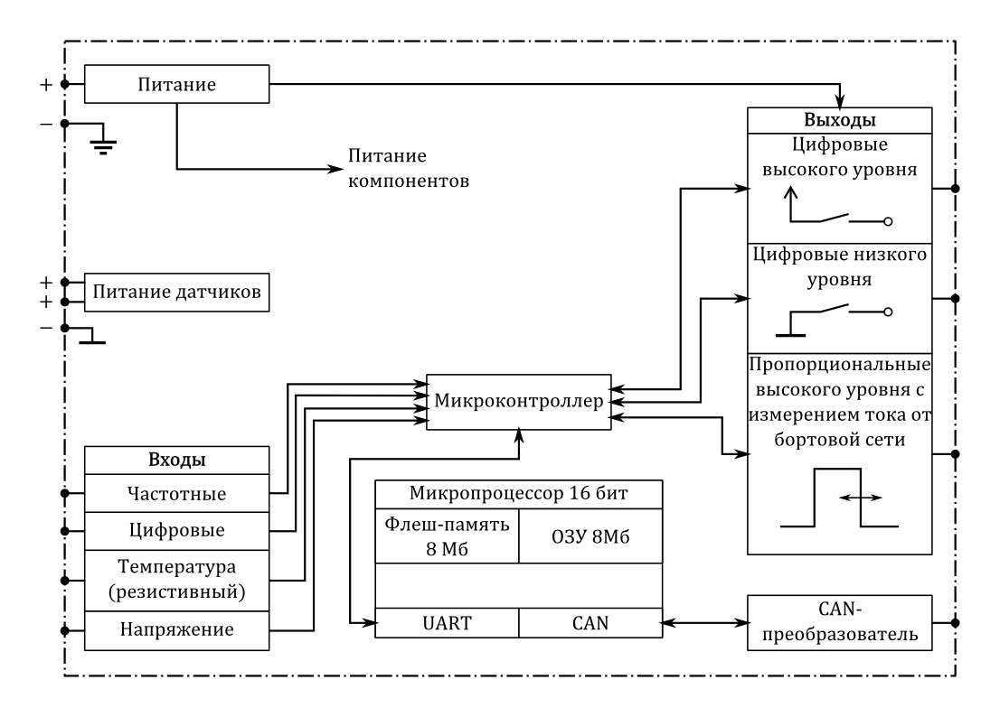
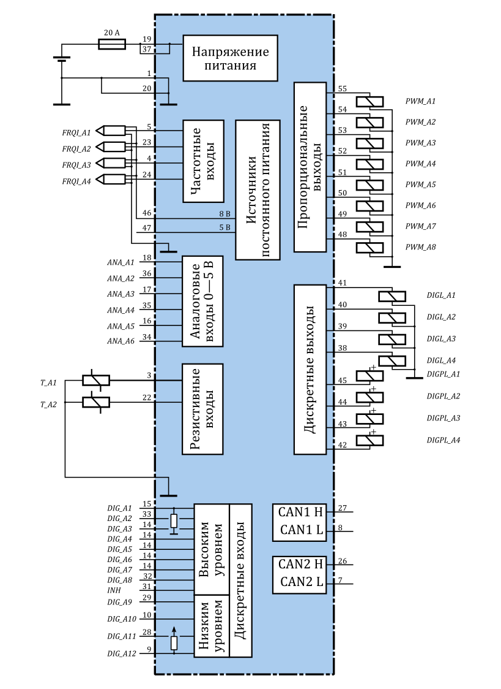

*******
ЭБУ ГМП
*******

Описание
========

ЭБУ ГМП ЛБИЕ.453639.004 является перепрограммируемым электронным устройством
управления на основе процессора SC186EX с тактовой частотой 96 МГц, рабочей
памятью 8 Мб, памятью программ 8 Мб.

Функциональная диаграмма
========================

  Функциональная диаграмма

Технические характеристики
==========================

.. table:: Основные технические характеристики ЭБУ ГМП

  +-------------------------------------------------------------+-----------------------------------+ 
  | Название параметра                                          | Значение                          | 
  +=============================================================+===================================+ 
  | Допустимый диапазон рабочего напряжения, В                  | 8 - 32                            | 
  +-------------------------------------------------------------+-----------------------------------+ 
  | Потребляемый ток без нагрузки, A                            | 0,5                               | 
  +-------------------------------------------------------------+-----------------------------------+
  | Потребляемый ток с учетом включения всех электромагнитов, A | 7                                 | 
  +-------------------------------------------------------------+-----------------------------------+
  | Напряжение питания  контроллера                             | бортовая сеть 24 В по ГОСТ 3940   |
  +-------------------------------------------------------------+-----------------------------------+
  | Вид климатического исполнения                               | О1 по ГОСТ 15150                  |
  +-------------------------------------------------------------+-----------------------------------+
  | Диапазон рабочих температур окружающей среды                | -40...+85 °С                      |
  +-------------------------------------------------------------+-----------------------------------+

Диагармма подключения
=====================

  Диаграмма подключения

Обзор доступных функций
=======================
